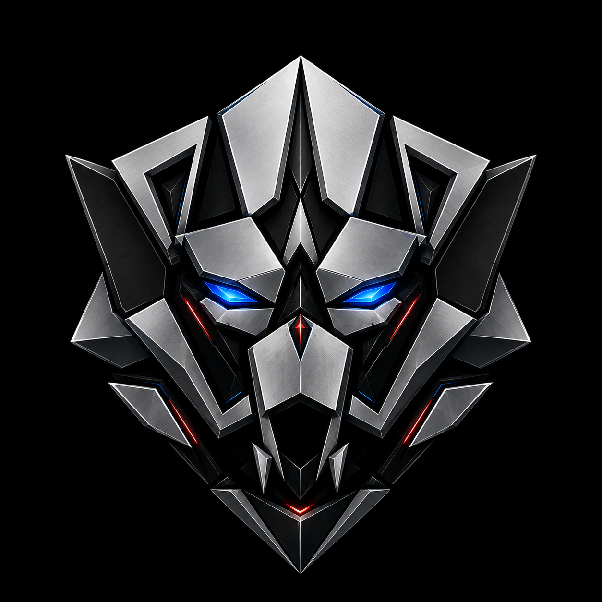

━━━━━━━━━━━━━━━━━━━━━━━━━━━━━━━━━━━━━━━━━━━━━━━━━━

## 🤖 Sobre mí / About me

<b>🇪🇸 Español</b>

 

Soy **Alex Lazarte**, desarrollador Full-Stack especializado en **plataformas E-Learning, productos SaaS e integraciones de pago con Stripe**, usando NextJS, NestJS y Django. Construyo y despliego aplicaciones completas: desde el diseño de base de datos hasta el despliegue en la nube (AWS).

Actualmente lidero el desarrollo de una plataforma comercial de E-Learning (suscripciones, pagos, entrega de cursos) en **Shema Yisrael S.R.L.**, donde soy responsable de las decisiones de arquitectura, la calidad del código, los tiempos de entrega y la infraestructura en AWS.

🏆 **2º lugar, Microsoft Bolivia AI Hackathon 2025** con [YachaFlex](https://github.com/alekai21), una plataforma de aprendizaje adaptativo que detecta el estrés del estudiante combinando biometría de smartwatch con modelos de IA (Hugging Face Transformers).

**Cómo trabajo:** comunicación clara, estimaciones realistas, entregas incrementales revisables cada semana (Scrum/Kanban), y código limpio y documentado.

<b>🇬🇧 English</b>

 

I'm **Alex Lazarte**, a Full-Stack Developer specialized in **E-Learning platforms, SaaS products, and Stripe payment integrations**, using NextJS, NestJS, and Django. I build and ship complete web applications — from database design to cloud deployment on AWS.

Currently leading development of a commercial E-Learning platform (subscriptions, payments, course delivery) at **Shema Yisrael S.R.L.**, where I own architecture decisions, code quality, delivery timelines, and the AWS infrastructure it runs on.

🏆 **2nd place, Microsoft Bolivia AI Hackathon 2025** with [YachaFlex](https://github.com/alekai21), a stress-aware adaptive learning platform that detects student stress by combining smartwatch biometrics with AI models (Hugging Face Transformers).

**How I work:** clear communication, realistic estimates, incremental deliveries you can review every week (Scrum/Kanban), and clean, documented code you can maintain after the project ends.

━━━━━━━━━━━━━━━━━━━━━━━━━━━━━━━━━━━━━━━━━━━━━━━━━━

## ⚙️ Stack tecnológico / Tech stack

**Frontend**

**Backend**

**Cloud & DevOps**

**Pagos & Bases de datos**

**AI/ML & Mobile**

━━━━━━━━━━━━━━━━━━━━━━━━━━━━━━━━━━━━━━━━━━━━━━━━━━

## 📊 GitHub Stats

## 📈 Actividad de contribuciones / Contribution activity

<picture>
  <source media="(prefers-color-scheme: dark)" srcset="assets/contributions-snake-dark.svg">
  <source media="(prefers-color-scheme: light)" srcset="assets/contributions-snake-light.svg">
  
</picture>

Se regenera automáticamente cada día vía GitHub Actions · Auto-regenerated daily via GitHub Actions

━━━━━━━━━━━━━━━━━━━━━━━━━━━━━━━━━━━━━━━━━━━━━━━━━━

## 📡 Contacto / Contact

🤖 "Más que los ojos pueden ver" · "More than meets the eye"

